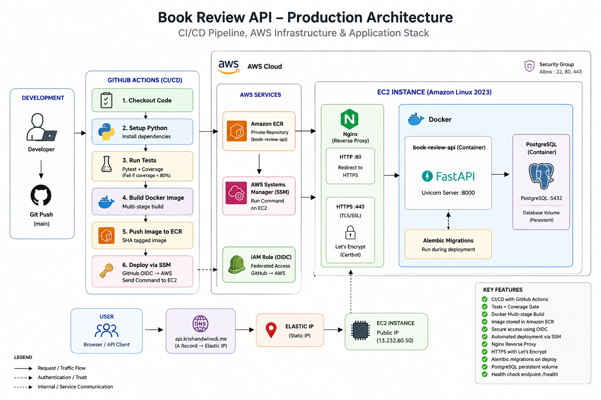
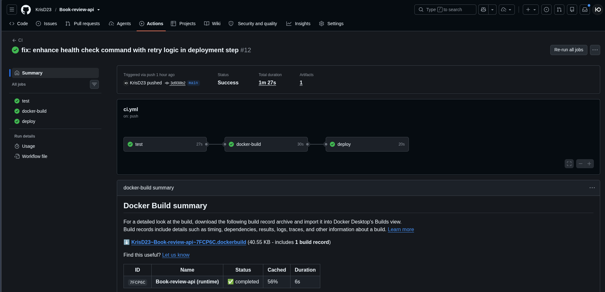
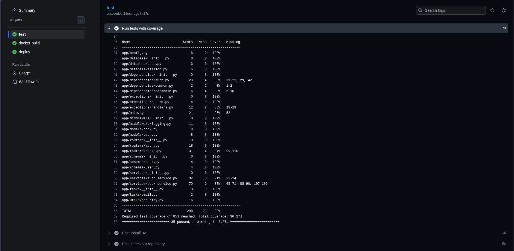
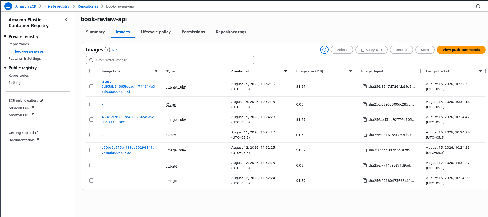
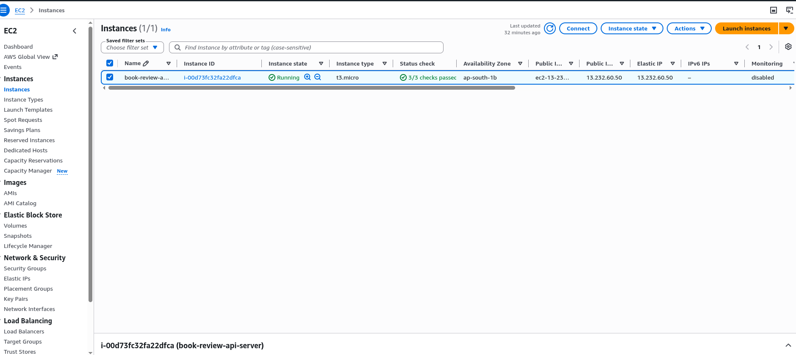
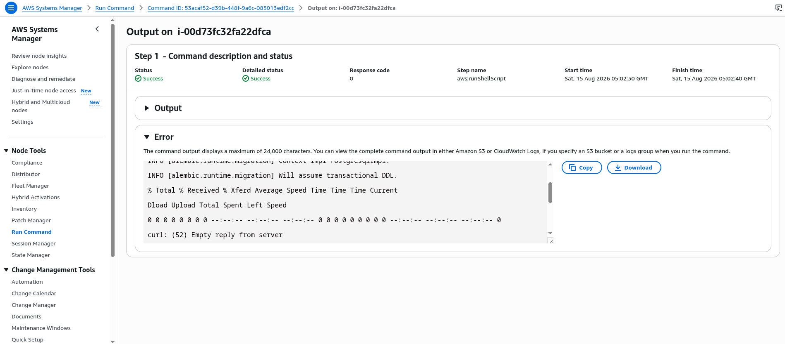
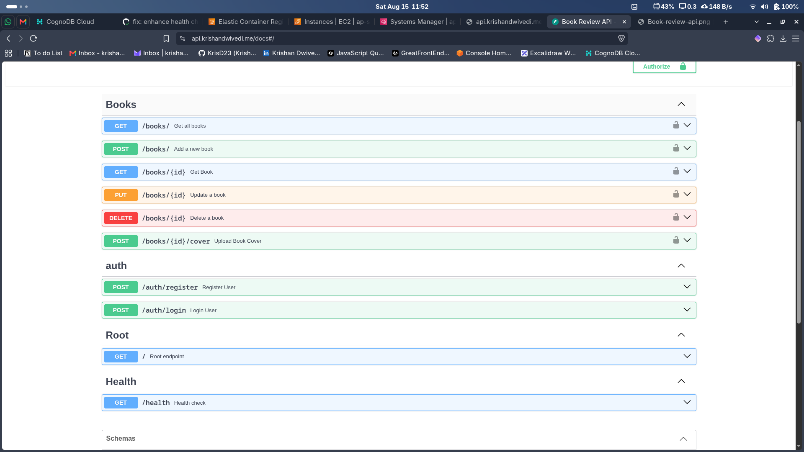

# Book Review API

A production-style REST API built with **FastAPI, PostgreSQL, SQLAlchemy, and Docker**, featuring JWT authentication, automated testing, database migrations, and an AWS CI/CD deployment pipeline.

## Architecture



```text
GitHub
   ↓
GitHub Actions
   ├── Tests + Coverage
   └── Docker Build
   ↓
GitHub OIDC → AWS IAM
   ↓
Amazon ECR
   ↓
AWS Systems Manager
   ↓
Amazon EC2
   ↓
Nginx + HTTPS
   ↓
Docker
   ├── FastAPI
   └── PostgreSQL
```

## Features

- RESTful CRUD API for books
- User registration and authentication
- OAuth2 + JWT authentication
- User-owned book resources
- PostgreSQL database with SQLAlchemy ORM
- Alembic database migrations
- Pydantic request/response validation
- Custom exception handling
- Request logging middleware
- Dockerized application and database
- Automated testing with Pytest
- CI coverage gate
- Automated AWS deployment

## Tech Stack

| Area           | Technologies                   |
| -------------- | ------------------------------ |
| Backend        | FastAPI, Python, Pydantic      |
| Database       | PostgreSQL, SQLAlchemy         |
| Migrations     | Alembic                        |
| Authentication | OAuth2, JWT, Argon2            |
| Testing        | Pytest, pytest-cov             |
| Containers     | Docker, Docker Compose         |
| CI/CD          | GitHub Actions                 |
| AWS            | ECR, EC2, IAM, Systems Manager |
| Infrastructure | Nginx, Let's Encrypt, DNS      |

## API Endpoints

```text
POST   /auth/register
POST   /auth/login

GET    /books
GET    /books/{id}
POST   /books
PUT    /books/{id}
DELETE /books/{id}

GET    /health
```

FastAPI automatically provides interactive Swagger documentation at `/docs`.

## CI/CD

Every push to `main` runs the deployment pipeline:

```text
Push to main
     ↓
Run Tests
     ↓
Coverage ≥ 85%
     ↓
Build Docker Image
     ↓
Authenticate to AWS using OIDC
     ↓
Push Image to Amazon ECR
     ↓
Deploy through AWS Systems Manager
     ↓
Run Alembic Migrations
     ↓
Restart Application Container
     ↓
Health Check
```

GitHub Actions authenticates with AWS using **OpenID Connect (OIDC)** and temporary credentials instead of storing long-lived AWS access keys.

Docker images are tagged with both `latest` and the Git commit SHA.

## Testing

Run the test suite with:

```bash
uv run pytest --cov=app --cov-report=term-missing
```

The CI pipeline requires at least **85% coverage** before the deployment can continue.

## Local Development

Clone the repository:

```bash
git clone https://github.com/KrisD23/Book-review-api.git
cd Book-review-api
```

Install dependencies:

```bash
uv sync
```

Configure the required environment variables and run:

```bash
uv run uvicorn app.main:app --reload
```

Or use Docker Compose:

```bash
docker compose up --build
```

Run database migrations with:

```bash
uv run alembic upgrade head
```

## Production Deployment

The API was deployed on **AWS EC2** using a containerized production environment.

- **Amazon ECR** stores production Docker images.
- **EC2** hosts the application.
- **AWS Systems Manager** performs deployments without SSH credentials in CI.
- **IAM roles** provide AWS permissions.
- **GitHub OIDC** provides temporary AWS credentials to GitHub Actions.
- **Nginx** acts as the reverse proxy.
- **Let's Encrypt / Certbot** provides TLS certificates and automatic renewal.
- **PostgreSQL** runs in a private Docker network with persistent storage.
- **Alembic** applies database migrations during deployment.

## Deployment Evidence

### GitHub Actions

Automated testing, Docker builds, and deployment run through GitHub Actions.



### Test Coverage

Pytest runs automatically with a required coverage threshold before deployment.



### Amazon ECR

Production Docker images are built by GitHub Actions and pushed to Amazon ECR.



### Amazon EC2

The containerized application was hosted on an Amazon EC2 instance.



### AWS Systems Manager

Deployments to EC2 are executed through AWS Systems Manager instead of exposing SSH credentials to the CI pipeline.



### Swagger API

FastAPI provides interactive OpenAPI documentation for testing the deployed API.



### Health Check

The deployed application exposes a health endpoint for deployment verification.

## Demo

A complete recording of the deployed API, AWS infrastructure, CI/CD pipeline, and API functionality:

**[Watch Deployment Demo](https://drive.google.com/file/d/1XBOkNLhn8ChdbAERvfK20LbLCi7f45-v/view)**

## Project Structure

```text
app/
├── database/
├── dependencies/
├── exceptions/
├── middleware/
├── models/
├── routers/
├── schemas/
├── services/
└── utils/

tests/
alembic/
.github/workflows/

Dockerfile
docker-compose.yml
pyproject.toml
```

---

Built as a hands-on backend engineering project covering API development, testing, containerization, CI/CD, and AWS deployment.
